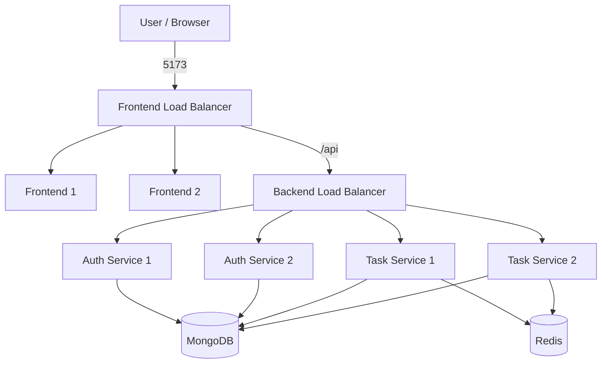
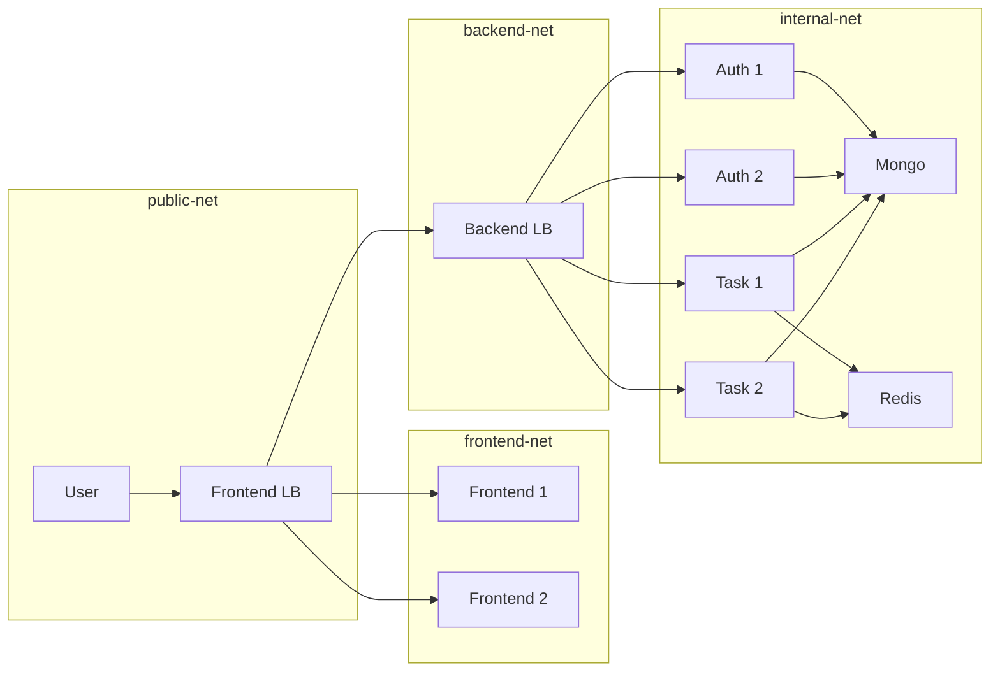

# 🧱 Scalable Microservices Architecture (Docker + Load Balancing)

This project is a **hands-on implementation of a production-style microservices architecture**, built while learning Docker, container networking, and load balancing. The main goal was to understand how a real application can be deployed using microservices, along with supporting components like databases and caching systems, all managed through containerization using Docker.

---

## 🛠️ Tech Stack Used

### Frontend
- **React (Vite)** – SPA frontend
- **Nginx** – used to serve the built frontend

### Backend
- **Node.js + Express**
### 2 services
- **Auth Service** – login / signup / JWT handling
- **Task Service** – CRUD operations for tasks

### Databases & Caching
- **MongoDB** – primary persistent database
- **Redis** – caching, Rate Limiting and fast in-memory operations 

### Infrastructure
- **Docker & Docker Compose** – containerization and orchestration
- **Nginx** – used as load balancer (L7 / HTTP)
- **Multiple Docker networks** – to simulate real production isolation

---

## 📦 Containers in This Project

When the project is running, the following containers will be created:

### Frontend Layer
- `frontend-lb` – public-facing Nginx load balancer
- `frontend-1`, `frontend-2` – frontend replicas (React served by Nginx)

### Backend Layer
- `backend-lb` – internal Nginx load balancer for APIs
- `auth-service-1`, `auth-service-2` – auth service replicas
- `task-service-1`, `task-service-2` – task service replicas

### Data Layer
- `mongodb` – MongoDB container
- `redis` – Redis container

Each service is **stateless**, so replicas can be added or removed without breaking the system.

---


## 📐 Architecture Diagrams (Mermaid)

### Logical Architecture



---

### Network-Aware Architecture



---

## 🌐 Network Design (Why Multiple Networks?)

Instead of putting everything in one network, I have used **multiple Docker networks intentionally** to simulate real production environments.

| Network | Purpose |
|------|------|
| `public-net` | Only exposes the frontend load balancer to the host |
| `frontend-net` | Frontend LB ↔ Frontend containers |
| `backend-net` | Frontend LB ↔ Backend LB |
| `internal-net` | Backend LB ↔ Backend services ↔ Databases |

### Why this matters:
- Backend services are **not accessible from the host**
- Databases are **not accessible from frontend containers**
- All traffic flows through **controlled entry points** (load balancers). 

---

## 🔀 Load Balancer Design & Logic

### 1️⃣ Frontend Load Balancer (API Gateway)

Responsibilities:
- Acts as the **single entry point** for users
- Serves frontend UI requests (`/`)
- Forwards API requests (`/api/*`) to the backend load balancer

Benefits:
- Frontend replicas can scale horizontally
- Frontend container failures do not affect users
- Frontend code never needs backend service URLs (frontend dosen't know where to find backend it just routes it to /api)

---

### 2️⃣ Backend Load Balancer (Internal Routing)

Responsibilities:
- Receives API traffic from frontend LB
- Routes requests based on path:
  - `/api/auth/*` → Auth service replicas
  - `/api/tasks/*` → Task service replicas

Benefits:
- Backend services scale independently
- Clear separation between different backend domains
- Easy to add new services later (just another route)

---

## ▶️ Running the Project

### Basic Startup
```bash
docker compose up
```
Starts one instance of each service.

---

## 🔁 Running with Multiple Replicas (Scaling)

To simulate real-world load handling and fault tolerance, you can scale services using Docker Compose:

```bash
docker compose up --scale frontend=2 --scale auth-service=2 --scale task-service=2
```

### What this command does:

| Service | Replicas |
|-------|----------|
| Frontend | 2 |
| Auth Service | 2 |
| Task Service | 2 |

- Docker Compose spins up multiple containers per service
- Nginx load balancers automatically distribute traffic
- If one container fails, traffic is routed to healthy replicas

> Scaling works because all services are **stateless**.

---

## ⚙️ Environment Configuration (`.env` Files)

This project intentionally separates environment configuration to match real-world microservice systems.

---

### 📌 Root `.env` (Docker Compose Level)

Located at the **project root** and used by `docker-compose.yml`.

Purpose:
- Shared configuration values
- Database & Redis connection URLs
- Infrastructure-level settings

Example:
```env
MONGO_DB_URL=mongodb://mongodb:27017/tasks
REDIS_URL=redis://redis:6379
PORT=4000
```

Docker Compose injects these values into containers at runtime.

---

### 📌 Service-Level `.env` Files (Backend)

Each backend service has its **own `.env` file**:

```
backend/
 ├── auth-service/
 │   └── .env
 └── task-service/
     └── .env
```

#### Why separate `.env` files?

Each service is an independent microservice and owns:
- Its secrets
- Its runtime configuration
- Its business logic

This enables:
- Independent scaling
- Isolated secrets
- Cleaner service boundaries

---


## 🔁 End-to-End Request Flow (Example)

### User Login Request

1. Browser sends:
   ```
   POST http://localhost:5173/api/auth/login
   ```

2. Frontend Load Balancer:
   - Receives the request
   - Detects `/api/*`
   - Forwards to Backend Load Balancer

3. Backend Load Balancer:
   - Matches `/api/auth/*`
   - Routes to one Auth Service replica

4. Auth Service:
   - Processes authentication
   - Reads/writes data from MongoDB

5. Response flows back to the user

If **any container stops**, traffic is automatically routed to remaining replicas.

---

## 🧠 How This Matches Production Systems

This setup mirrors real-world architectures:

| This Project | Production Equivalent |
|---|---|
| Frontend LB | Ingress / API Gateway / ALB |
| Backend LB | Internal Service / Nginx / Envoy |
| Docker networks | VPC subnets |
| Replicas | Auto-scaling groups / Deployments |

The same design principles apply when moving to **Kubernetes or cloud platforms**.

---

## Summary

This project focuses on **learning system design by building**, not just running containers.

Key takeaways:
- Load balancers are **routing layers**, not just proxies
- Networking defines **security boundaries**
- Stateless services enable **horizontal scaling**
- Failures are expected and handled gracefully
